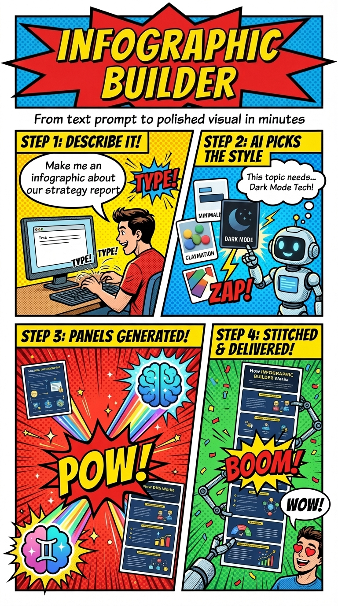
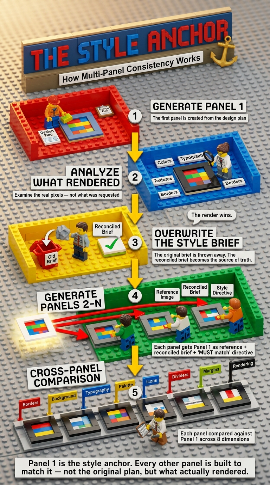

# infographic-builder for Claude Code

[](LICENSE)
[](https://docs.anthropic.com/en/docs/claude-code)
[](https://ai.google.dev/)

<div align="center">
  
  <br><br>
  <strong>Say what you want, get a finished infographic.</strong>
  <br>
  Claude handles layout, color, typography, and multi-panel composition automatically.
  <br>You steer with plain English.
</div>

<br>

This is a [Claude Code](https://docs.anthropic.com/en/docs/claude-code) plugin that brings the design system from [infographic-builder](https://github.com/singh2/infographic-builder) (originally built for Microsoft Amplifier) to Claude Code as a slash command.

## Contents

- [Get started](#get-started)
- [Examples](#examples)
- [Pick your style](#pick-your-style)
- [The right layout, picked automatically](#the-right-layout-picked-automatically)
- [Every panel matches](#every-panel-matches)
- [Controls](#controls)
- [How it works](#how-it-works)
- [Configuration](#configuration)
- [Troubleshooting](#troubleshooting)
- [Contributing](#contributing)

## Get started

### 1. Prerequisites

| Prerequisite | Check |
|---|---|
| [Claude Code](https://docs.anthropic.com/en/docs/claude-code) | `claude --version` |
| Python 3.11+ | `python3 --version` |
| Google API key ([get one](https://aistudio.google.com/apikey)) | Gemini API enabled |

### 2. Install the plugin

Run these in Claude Code (one-time setup):

```
/plugin marketplace add singh2/infographic-builder-cc
/plugin install infographic-builder@infographic-builder
```

This installs to **user scope**, so the plugin is available in every Claude Code session — regardless of which project you're working in.

### 3. Install Python dependencies

```bash
pip install google-genai pillow
```

### 4. Set your API key

Add this to your `~/.zshrc` or `~/.bashrc`:

```bash
export GOOGLE_API_KEY="your-key-here"
```

Then restart your terminal (or `source ~/.zshrc`) for it to take effect.

### 5. Try it

```
/infographic-builder:infographic how DNS resolution works
```

You'll get back `.png` file(s), a design rationale, and suggestions for refinement.

> **Tip:** You can also just describe what you want naturally — the skill
> auto-activates when Claude detects an infographic request:
>
> ```
> Create an infographic about the history of the internet in claymation style
> ```

### Updating

When a new version is released, Claude Code will pick it up automatically if you have auto-update enabled for the marketplace. You can also update manually:

```
/plugin marketplace update
```

### Alternative: local development

If you want to hack on the plugin itself, clone and run directly:

```bash
git clone https://github.com/singh2/infographic-builder-cc.git
cd infographic-builder-cc
python3 -m venv .venv
source .venv/bin/activate
pip install -r requirements.txt
claude --plugin-dir /path/to/infographic-builder-cc
```

## Examples

<table>
  <tr>
    <td></td>
    <td></td>
  </tr>
  <tr>
    <td align="center"><em>DevOps Lifecycle<br/>Claymation Studio</em></td>
    <td align="center"><em>How Surfing Works<br/>Bold Editorial · 3 panels</em></td>
  </tr>
</table>

<br>

### What to ask for

**Dev teams** — feed it the artifacts you already have

- `"Show me a diagram of how our app works"` — reads your codebase and generates an architecture visual
- `"Make an onboarding guide for new engineers joining this repo"` — reads the codebase, generates a walkthrough
- `"Here's our incident postmortem — make a timeline of what happened"` — turns a doc into a narrative timeline

**Knowledge work** — meetings, decisions, progress

- `"Summarize this strategy doc as a one-pager visual"` — condenses a doc into a scannable infographic
- `"Explain how LLMs work — make it visual"` — breaks down a complex topic into an educational infographic
- `"Here's meeting.vtt — visualize the key decisions"` — extracts structure from a transcript

**For fun**

- `"Make a claymation guide to brewing the perfect espresso"` — detects style inline, auto-picks a process flow
- `"Infographic ranking every Star Wars movie"` — auto-splits into panels when content is dense
- `"Create a travel planning infographic for my Japan trip"` — turns an itinerary into a visual journey

## Pick your style

<div align="center">
  
</div>

<br>

Six curated aesthetics — from **Clean Minimalist** (boardroom-ready) to **Lego Brick Builder** (plastic studs and tilt-shift macro photography) — plus **Freeform** for anything you can describe.

Say it inline (`"make a claymation infographic about..."`) and the agent skips straight to generation. Or leave it open and you'll get a menu to choose from.

---

## The right layout, picked automatically

<div align="center">
  
</div>

<br>

The agent analyzes your content and picks the best layout automatically — process flow, comparison grid, timeline, hierarchy, funnel, mind map, and more.

You never need to think about this. But if you want to override: `"use a timeline layout"` or `"make it a comparison"`.

---

## Every panel matches

<div align="center">
  
</div>

<br>

Dense topics are automatically split into up to 6 panels. The hard part is keeping them visually consistent.

**Panel 1 is the style anchor.** After it renders, the agent analyzes what Gemini *actually produced* — not what was planned — and overwrites the style brief. Every subsequent panel is generated with Panel 1's image as a reference. After generation, each panel is compared against Panel 1 across 8 visual dimensions.

> *The render wins. Not the plan.*

---

## Vetted for quality

<div align="center">
  
</div>

<br>

Every infographic goes through a self-critique loop on 5 dimensions before delivery. If issues are found, the agent refines and regenerates (max once).

The design system behind this plugin was developed and validated using a **standalone evaluation harness** (in the [upstream repo](https://github.com/singh2/infographic-builder)) that batch-tests across 23 scenarios using vision-model scoring.

<details>
<summary>Scoring rubric and evaluation background</summary>

<br>

### In-agent quality review

Every infographic the plugin generates is reviewed before delivery. The agent sends each image to Gemini for analysis against these dimensions:

| Dimension | What it measures |
|-----------|------------------|
| Content Accuracy | Are the requested data points, labels, and concepts present? |
| Layout Quality | Is the structure clear? Can a viewer follow the flow? |
| Visual Clarity | Is text readable? Sufficient contrast? Good whitespace? |
| Prompt Fidelity | Does the output match the specified style, layout, and colors? |
| Aesthetic Fidelity | Does the output match the requested aesthetic? |

For multi-panel infographics, the agent also runs a **cross-panel comparison** — checking 8 visual dimensions (border treatment, background, typography, color palette, icon style, divider lines, spacing, rendering style) between Panel 1 and each subsequent panel.

If issues are found, the agent refines the prompt to address *only* the specific problems and regenerates. Max one refinement pass — if the second attempt still has issues, it's returned with the review notes so you can steer from there.

### Evaluation harness (upstream)

The [infographic-builder](https://github.com/singh2/infographic-builder) repo includes a full evaluation harness that was used to develop and validate the design system this plugin uses:

- **23 test scenarios** across 3 tiers: Specified (full visual spec in prompt), Natural (conversational requests), and Aesthetic (named curated styles)
- **Panel counts from 1-6** covering single-panel through complex multi-panel compositions
- **GPT-5.4 vision scoring** on 5 weighted dimensions (Visual Explanation 25%, Content Accuracy 20%, Typography & Legibility 20%, Visual Quality & Consistency 20%, Narrative Structure 15%)
- **Composite scores recalculated** from dimension scores — never trusting the model's self-reported composite (guards against self-reporting bias)
- **Baseline comparison** for tracking quality trends across runs

| Score | Band |
|-------|------|
| 4.0 - 5.0 | High quality |
| 3.0 - 3.9 | Acceptable |
| 2.0 - 2.9 | Below bar |
| 1.0 - 1.9 | Failed |

The aesthetics, layout heuristics, decomposition rules, style reconciliation protocol, and quality review prompts in this plugin were all iterated against that harness.

</details>

---

## Controls

| Control | Example |
|---------|---------|
| **Aesthetic** | `"make it claymation"` / `"dark mode tech"` / `"keep it minimal and corporate"` |
| **Layout** | `"use a timeline layout"` / `"make it a comparison"` |
| **Panels** | `"single panel only"` / `"make it a 4-panel infographic"` |
| **Skip review** | `"skip the review"` — faster generation, no quality check pass |

### Where output goes

| Output | Filename |
|--------|----------|
| Single-panel infographic | `./infographics/{topic}.png` |
| Multi-panel set | `./infographics/{topic}_panel_1.png`, `_panel_2.png`, ... |
| Stitched composite | `./infographics/{topic}_combined.png` |

## How it works

```
User: "Create an infographic about photosynthesis"
  |
  +-- Claude analyzes content, selects layout type
  +-- User picks aesthetic (or Claude detects inline style)
  +-- Claude plans design: palette, typography, icons
  |
  +-- generate.py generate --> Gemini API --> panel_1.png
  +-- generate.py analyze  --> captures actual rendered style
  +-- generate.py generate --> Gemini API --> panel_2.png (with Panel 1 as reference)
  +-- generate.py analyze  --> quality review (5 dimensions)
  |
  +-- stitch.py --> combined.png
  |
  +-- Claude returns: images + design rationale + review summary + next steps
```

**Key design concepts:**

- **Style anchor** — Panel 1 is generated first. The agent then analyzes what Gemini *actually rendered* (not what was planned) and uses that as the reference for all subsequent panels. The render wins, not the plan.
- **Quality review** — Every image is scored on 5 dimensions: content accuracy, layout quality, visual clarity, prompt fidelity, and aesthetic fidelity. If issues are found, the agent refines and regenerates (max once).
- **Auto-decomposition** — Dense topics are automatically split into up to 6 panels based on content density. Simple topics stay as a single panel.

## Configuration

| Environment Variable | Default | Description |
|---|---|---|
| `GOOGLE_API_KEY` | *(required)* | Your Gemini API key |
| `GEMINI_GENERATION_MODEL` | `gemini-3.1-flash-image-preview` | Model for image generation (falls back to `gemini-3-pro-image-preview`) |
| `GEMINI_ANALYSIS_MODEL` | `gemini-2.0-flash` | Model for image analysis and comparison |

## Troubleshooting

| Problem | Fix |
|---------|-----|
| `GOOGLE_API_KEY` error | `export GOOGLE_API_KEY=your-key` — the #1 first-run issue |
| `ModuleNotFoundError: google` | Activate the venv: `source /path/to/infographic-builder-cc/.venv/bin/activate` |
| Skill not found when typing `/infographic-builder:infographic` | Make sure you installed the plugin: `/plugin marketplace add singh2/infographic-builder-cc` then `/plugin install infographic-builder@infographic-builder` |
| Image text is garbled or unreadable | Simplify: fewer data points, shorter labels, larger text emphasis in your prompt |
| Wrong layout for your content | Tell it explicitly: `"use a timeline layout"` or `"make it a comparison"` |
| Too many panels (or too few) | Specify: `"make it a 2-panel infographic"` — explicit count always wins |
| Slow generation | Say `"skip the review"` to skip the quality check pass |

---

<details>
<summary><strong>Project structure</strong></summary>

<br>

```
infographic-builder-cc/
|-- .claude-plugin/
|   |-- plugin.json                # plugin manifest
|   +-- marketplace.json           # marketplace manifest (for distribution)
|-- skills/
|   +-- infographic/
|       +-- SKILL.md               # skill definition: workflow + design knowledge
|-- scripts/
|   |-- generate.py                # Gemini API wrapper (generate, analyze, compare)
|   +-- stitch.py                  # panel stitching (Pillow-based)
|-- docs/
|   |-- readme/                    # images used in this README
|   +-- showcase/                  # example infographic outputs
|-- requirements.txt               # Python dependencies
+-- README.md
```

</details>

## Roadmap

- **Browsable style catalog** — a website where you can browse all aesthetic x layout combinations with a moodboard, so you can see what's possible before asking for a specific style. Coming soon.

## Contributing

Issues and PRs are welcome.

## License

[MIT](LICENSE)
